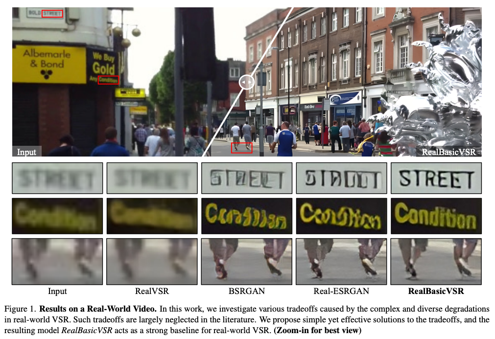
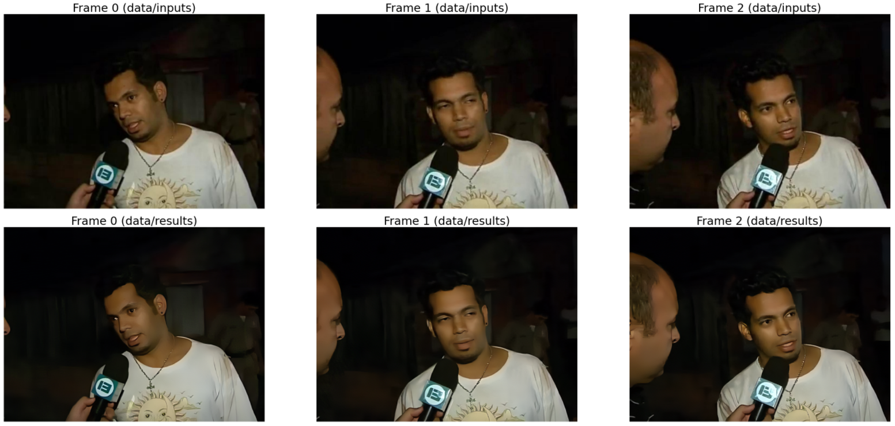

# Upscaling videos (even YouTube) with VSR

This repository shows a quick demo for how to upscale videos downloaded from YouTube using the implementation of ["Investigating Tradeoffs in Real-World Video Super-Resolution, arXiv"](https://arxiv.org/pdf/2111.12704.pdf). Code has been modified from the [official repo](https://github.com/ckkelvinchan/RealBasicVSR).



## Get started with SR (Super Resolution)
- [How Super Resolution Works](https://www.youtube.com/watch?v=KULkSwLk62I&ab_channel=LeoIsikdogan)
- [MMEditing](https://github.com/open-mmlab/mmediting). MMEditing is an open source image and video editing toolbox based on PyTorch.
- [List of accepted papers in the "New Trends in Image Restoration and Enhancement" workshop (CVPR2021)](https://openaccess.thecvf.com/CVPR2021_workshops/NTIRE)
- [BasicVSR++](https://ckkelvinchan.github.io/projects/BasicVSR++/). An improvement over RealBasicVSR from the same authors.
- [Image Super-Resolution via Iterative Refinement](https://iterative-refinement.github.io/). [Code](https://github.com/Janspiry/Image-Super-Resolution-via-Iterative-Refinement). Google Research.
- [Two-minute Papers Review on Super-Resolution](https://www.youtube.com/watch?v=WCAF3PNEc_c&ab_channel=TwoMinutePapers)
- [SwinIR: Image Restoration Using Swin Transformer](https://github.com/JingyunLiang/SwinIR). [HuggingFace Spaces](https://huggingface.co/spaces/akhaliq/SwinIR)
- [VRT: A Video Restoration Transformer](https://arxiv.org/pdf/2108.10257.pdf). [Repo](https://github.com/JingyunLiang/VRT). From the same authors of `SwinIR`. Achieves SoTA **(up to 2.16dB)** in video SR (REDS, Vimeo90K, Vid4 and UDM10), video deblurring (GoPro, DVD and REDS), video denoising (DAVIS and Set8)
- [Waifu2x-Extension-GUI](https://github.com/AaronFeng753/Waifu2x-Extension-GUI). Photo/Video/GIF enlargement and Video frame interpolation using machine learning. Only runs on Windows.

## Example results

Here are some before and after images that have been processed through `RealBasicVSR`. Depending on how different the test data is from the trainig data used, results will vary. The `VideoLQ-Dataset` can be explored and downloaded [here](https://github.com/ckkelvinchan/RealBasicVSR/blob/master/README.md#videolq-dataset).



## Requirements
- [SageMaker Studio Lab Account](https://studiolab.sagemaker.aws/). Free GPU (T4) for up to 4 hours at a time. [See video](https://www.youtube.com/watch?v=FUEIwAsrMP4&ab_channel=machinelearnear) for more info.
- Python 3.7+
- PyTorch >= 1.7.1 and Torchvision >= 0.8.2. [Official instructions](https://pytorch.org/get-started/locally/)
- [mim](https://pypi.org/project/openmim) and [mmcv-full](https://pypi.org/project/mmcv-full/)
- [youtube-dl](https://github.com/ytdl-org/youtube-dl)
- see `requirements.txt` 

## How to run with your own videos

- Click the following button to open the example Notebook [](https://studiolab.sagemaker.aws/import/github/machinelearnear/openai-glide-text2im/blob/main/text2im.ipynb).
- Once opened, click on `Copy to Project` to clone the repo into Studio Lab. Because we have included an `environment.yml` file, Studio Lab will automatically build a Conda environment will all required dependencies. It will named `machinelearnear-RealBasicVSR-youtube` and will be selected by default when you open the sample Notebook.

## References
```bibtext
@article{chan2022investigating,
  author = {Chan, Kelvin C.K. and Zhou, Shangchen and Xu, Xiangyu and Loy, Chen Change},
  title = {Investigating Tradeoffs in Real-World Video Super-Resolution},
  journal = {IEEE Conference on Computer Vision and Pattern Recognition},
  year = {2022}
}
```